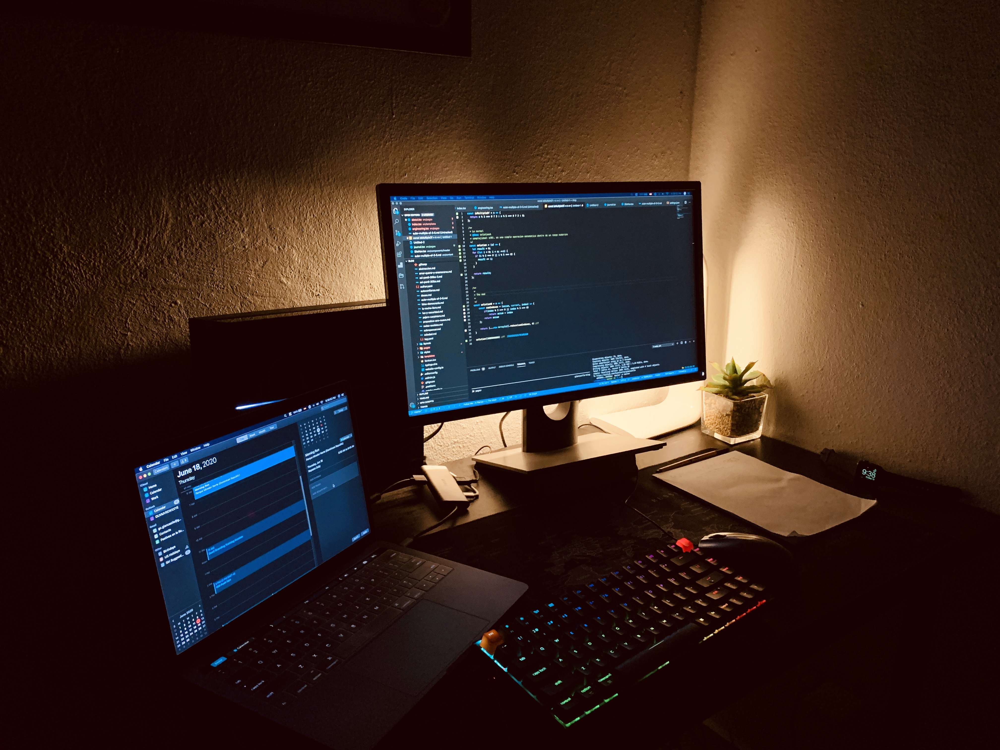

# A ver

No es raro en el campo de la programación quemarse o como se le conoce popularmente, _entrar en burnout_ y perder la pasión por nuestro trabajo. Solo es cuestion de navegar un poco por un portal como Stackexchange y buscar el termino burnout, notarás que habrán un centenar de preguntas que actuan como evidencia de que esto es un problema real y sobretodo muy normal en la industria del software y sin ir muy lejos, en toda la industria de TI.

## ¿Pero, por qué pasa esto?

Ciertamente, no lo sé. Lo que si sé con certeza es que nuestro campo esto ocurre mucho más frecuente que en otras areas. Sin embargo, en mi humilde opinion pienso que pueden haber unas cuantas razones por las que nos ocurre esto...

### Tus habitos

Miralo así... llegas al trabajo, te sientas en tu escritorio, o tal vez eres remoto y sólo te paras de la cama a tu mesa de trabajo. Estár frente a la computadora todos los días ciertamente no es saludable; te hace sentir más letárgico, aburrido, te conviertes en un nomuerto. El letargo también puede llevar a otros hábitos no tan buenos como comer durante el día todo lo que tenga que ver con productos superprocesados como una bolsa de aire con papas fritas, darse el gusto de tomar cualquier cosa que estimule el sistema nervioso, quedarse despierto hasta tarde y así sucesivamente. A la larga, todo esto te causa resentimiento a lo que amas.

> ¿Te suenan los memes de los developers con el café o de que somos gargolas?

### La pasion puede ser un arma de doble filo

Amamos programar, nos encanta pensar en como solucionar los problemas que afrontamos dia a dia en nuestra carrera; nos encanta ver ese CI corriendo todos los test y verlos marcados como passed, encontramos satisfacion en mover una tarjetica con la descripcion de un problema una columna a otra y sobretodo; amamos cuando vemos un correo que nos explica que esa tarjetica ahora tiene una etiqueta llamada "deployable". Sin embargo, todo esto puede quitarnos **demasiada energia**. Programar es un trabajo altamente intensivo y estresante desde el punto de vista cognitivo, y por supuesto, en algun momento...

> La fatiga mental siempre pasara a cobrar.

### No eres apasionado en lo que haces pero sigues programando

Puede ser que estés agotado porque el trabajo que haces es, de hecho, aburrido y poco gratificante para ti. Es justamente lo contrario a ser alguien apasionado. Te derrites por el hecho de estar haciendo algo que jamás harías sin dinero de por medio.

> Toma un tiempo libre y preguntate ¿te sentarias a programar un proyecto a alguien sin pensar en el dinero como un factor principal?

### Somos personas negativas por naturaleza

> [El burnout es causado cuando repetidamente hacemos hacen grandes cantidades de sacrificio y/o esfuerzo en problemas de alto riesgo que fallan. Es el resultado de un error de predicción negativo en nuestro Núcleo Accumbens (una parte de nuestro cerebro que nos permite "pensar"). Naturalmente, acondicionamos nuestro cerebro y su forma de pensar para asociar el trabajo con el fracaso](https://news.ycombinator.com/item?id=5630445)

¿Estás de acuerdo?... No hay un día sin que se produzcan fallos en la creación de software, nuestro trabajo consiste en la creación de esos fallos con o sin proposito y eventualmente ser solucionado. El software perfecto no existe.

### En fin

Yo mismo me he topado varias veces con el burnout. Ninguna de esas veces me hizo dejar la programación para siempre (Hellooow, amo programar), ni siquiera por un mes completo, pero al menos me hizo dudar en repetidas ocasiones de si elegí la profesión correcta. Desde entonces me he vuelto más estratégico en mi forma de trabajar para mantenerme motivado y productivo a largo plazo.

Aqui te dejo algunos consejos y técnicas son básicos y se aplican a todas las personas, incluso si no eres de TI como tal.

### Starter kit para evitar el burnout

1. **Come bien**. Tampoco es que tengas que convertirte en un vegano. Pequeños pasos hacen la diferencia, como beber agua en vez de refresco; incorpora más carbohidratos complejos y vegetales en tu dieta; come regularmente y no comas en exceso. Estos son los fundamentos que te haran ver una buena diferencia. Tambien puedes intentar [El ayuno intermintente](https://giancastle.com/asi-perdi-30lbs-2/) como expliqué en mi entrada de perdida de peso.
2. **Duerme bien**. Eso incluye conseguir un sueño de  calidad y suficiente. Hay muchas cosas que puedes hacer para crear un mejor ambiente de sueño y despertarte más fresco (empenzando a comer bien por ejemplo). Un consejo específico para los programadores con respecto al sueño es reducir la exposición a la luz azul que puede mantenerte despierto por la noche. Esto puede hacerse instalando [Flux](https://justgetflux.com/), que hace que el color de la pantalla del ordenador se adapte a la hora del día; aunque ya esto que viene integrado en muchos dispositivos.
3. **No sobretrabajes**. Esto puede sonar antinatural para aquellos que amamos programar pero, se ha demostrado una y otra vez que la productividad, que en este caso se refiere a la producción de código fuente, disminuye brutalmente después de cuatro horas de trabajo concentrado. Es casi imposible mantenerse productivo en un trabajo altamente intensivo cognitivamente hablando como la programación a largo plazo.
4. **Muevete. No seas un nomuerto**. Si me conoces, pensarás que hablaré de que vayas al gimnasio y hagas ejercicios allí, pero mucha gente tiene una idea equivocada al respecto, pensando que el ejercicio debe implicar ir al gimnasio y así... En realidad, mantenerse activo son cuestiones de simples tradeoffs; eligiendo las escaleras en lugar de un ascensor, estacionar el auto en la esquina más alejada del tu mall favorito; tomar el metro y caminar unas cuantas cuadras a pie al trabajo y encontrar otras formas de incorporar el movimiento en la vida diaria te hará sentir mejor y no sentirte atrapado frente a la computadora todo el día.

### Pro-tips para los desarrolladores

1. **Has cosas nuevas, experimenta**. Es muy rentable y productivo a corto plazo hacer lo que mejor sabes hacer. Por ejemplo, sigue creando sitios web de la misma manera que siempre los hiciste. Sin embargo, con el tiempo se vuelve aburrido y un subcionador de almas. La programación es en parte un proceso creativo y en otra parte ingeniería; también el uso de técnicas bien probadas para producir software. Pero, también se trata de divertirse, experimentar y probar nuevas ideas. Dedicar deliberadamente el 20% de tu tiempo a jugar con la tecnología es una de las estrategias más efectivas para evitar el burnout. Crear algo divertido y no relacionado con el trabajo, o convierte lo negativo en un problema (Soy testigode los millones de Covid-19 trackers que surgieron durante este año, tambien fui culpable de sumar uno a la lista) o invertir tiempo en aprender algo fuera de su zona de confort, como la programación funcional (Si me conoces, sabes porque mencioné esto).
2. **Conecta con otros. Escucha lo que los demás tienen para decir**. La programación puede ser solitaria. Conocer a otros desarrolladores, o escuchar sus experiencias en los podcasts o videos ayuda a estar no sólo en el día a día, sino también más atento a su trabajo. A nadie le gustan las quejas, pero compartir, o escuchar las luchas de otros programadores, es algo tranquilizador y puede ser motivador si escuchas cómo otros superaron sus luchas.
3. **Tómate un descanso y permitete perseguir otras pasiones.** Hay muchas actividades interesantes además de la programación. Adivina... deportes, eventos culturales, sexo, lectura, socializar, hiking, parrilladas, fotografía, etc. Si sigues haciendo una sola cosa todo el tiempo, como programar, un día inevitablemente te despertarás quemado y odiándote por no tener vida. Además, hacer algo aparentemente no relacionado con tu trabajo "real" podría reavivar tu pasión y provocar nuevas ideas.
4. **Considera la posibilidad de cambiar de trabajo, cambiar ligeramente las areas de interes o cambiar a un proyecto diferente**. Puede ser que estés atascado haciendo trabajos poco interesantes y que te chupen el alma en tu trabajo actual, como hacer cositas en un código existente durante todo el día. O tal vez el proyecto en el que trabajas ya no está alineado con tus intereses o valores. Además, si descubres que la programar ya no te excita, echa un vistazo a campos relevantes como la arquitectura de la información, la administración de sistemas, etc., que pueden alinearse más con tus pasiones.
5. **No seas tacaño con tus herramientras de trabajo**. Como desarrolladores de software, pasamos mucho tiempo sentados en un escritorio por lo que una buena forma de hacer esto más placentero es complacer nuestras necesidades y ciertos caprichos para mejorar nuestra productividad en frente de un monitor. Consigue la PC que compile rápido y no te haga esperar o tal vez... comprate una Mac. Asegúrate de tener una silla, una mesa y unos monitores cómodos y bien colocados. Si trabajas en un ambiente ruidoso, invierte en auriculares de alta calidad que bloqueen el ruido, permitiéndote estar en silencio si es necesario.
   

### En definitiva...

No hay una cura standar para el burnout, ya que el caso de cada uno es único. Sin embargo, las cosas mencionadas han funcionado para mí, y espero que funcionen para ti tambien.

Admito que esto es un listin y la lista de consejos es algo larga y lleva tiempo desarrollar nuevos hábitos. Y aunque comer sano, dormir bien, hacer ejercicio y cuidarse de otras maneras te ayudará a sentirse mejor, a desempeñarse mejor en tu trabajo y a mantener vivo el amor que alguna vez tuvo por la programación, para la mayoría de los programadores todo se reduce a lo básico.

Y eso... **requiere tener una vida**. No te masturbes mentalmente pensando que debes trabajar 10 horas al día, 6 días a la semana. Está científicamente probado que el rendimiento disminuye drásticamente despues de un rato, ya lo mencioné. Por lo tanto, mantente enfocado y efectivo mientras trabajas, y luego apágate completamente después del trabajo. Aprende a decir que no y haz algo que te guste además de programar. Ese es realmente el consejo #1, y siempre se mantendrá así.

